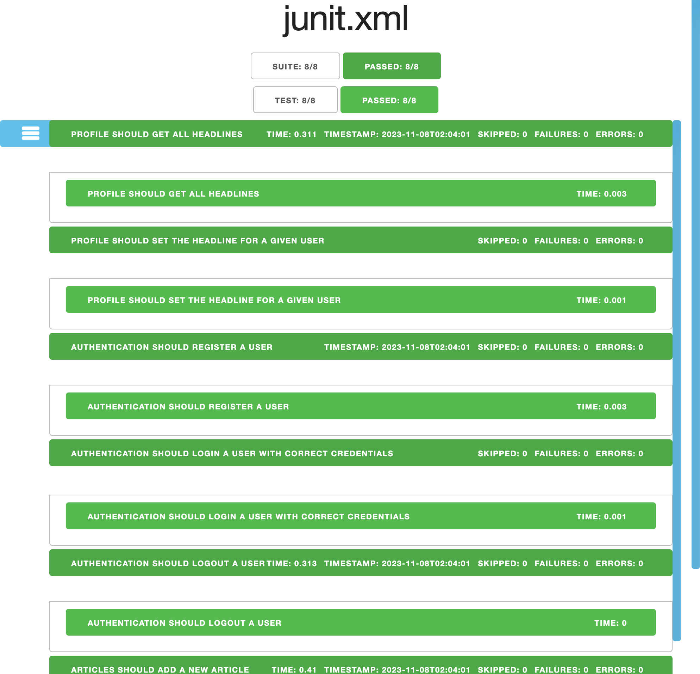

# ricebook-backend
* Course: COMP 431/531 Web Development
* Instructor: Prof. Mack Joyner
* Date: Fall 2023
## Author Info
* netid: dw73
* title: RiceBook
* site: 
## Test Report

junit Report

You can refer to the result on the [page](./test_results/report.html).

## Commands
npx junit-viewer --results=test_results/junit.xml --save=test_results/report.html

## Other
