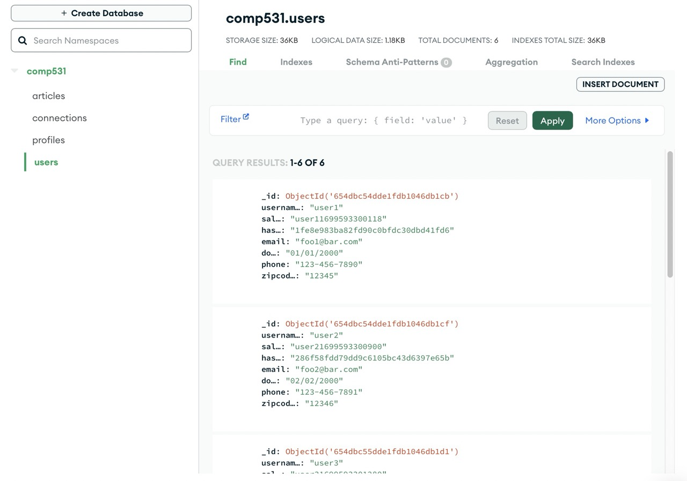
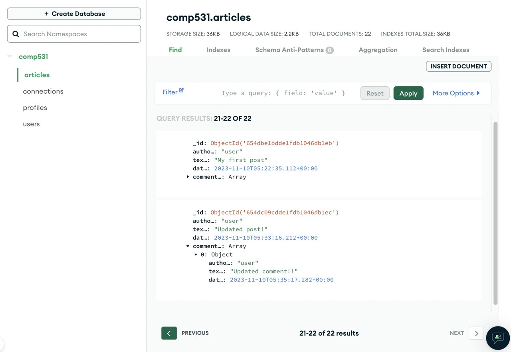

# ricebook-backend
* Course: COMP 431/531 Web Development
* Instructor: Prof. Mack Joyner
* Date: Fall 2023
## Author Info
* netid: dw73
* title: RiceBook
* backend: https://dw73ricebook-8686a4fab411.herokuapp.com
* local backend: http://127.0.0.1:3000
* frontend: 

## Backend Test
You can import test data to Postman for a local [server](./postman_test/local/) or my online [depeloyment](./postman_test/server/) to postman.

Login

Get email

Post article

Get following

## Backend Screentshot

Users

Articles

## Unit Test Report

junit Report

You can refer to the result on the [document](./test_results/report.html).
### Commands
npx junit-viewer --results=test_results/junit.xml --save=test_results/report.html

## Other
